# B+ 트리 인덱스 최소 구현 계획

## 1. 이번 과제의 핵심을 3줄로 정의

1. 이번 결과물의 본질은 메모리 안에 테이블을 저장하고, `id` 검색만 B+ 트리 인덱스로 빠르게 처리하는 작은 DB 실행기 하나를 만드는 것이다.
2. 레코드가 삽입될 때마다 자동 증가 `id`를 발급하고, 그 `id`를 즉시 B+ 트리에 등록해서 `WHERE id = 값` 경로가 선형 탐색을 타지 않게 해야 한다.
3. 나머지 일반 필드 검색은 단순 선형 탐색으로 남겨 두고, 100만 건 이상 데이터에서 두 방식의 속도 차이를 보여주면 과제의 핵심 요구를 충족한다.

## 2. 문서 해석 결과: 반드시 들어가야 하는 최소 기능

1. 구현 언어는 C여야 한다.
2. 저장 방식은 디스크 기반이 아니라 메모리 기반이어야 한다.
3. 레코드 삽입 시 `id`가 자동으로 증가하며 부여되어야 한다.
4. 삽입된 `id`는 B+ 트리 인덱스에 등록되어야 한다.
5. `SELECT ... WHERE id = ?`는 B+ 트리를 사용해야 한다.
6. `SELECT ... WHERE 다른필드 = ?`는 선형 탐색으로 처리되어야 한다.
7. 이전 차수의 SQL 처리기와 연결되는 구조여야 한다.
8. 1,000,000개 이상 레코드를 삽입하는 성능 테스트가 있어야 한다.
9. 인덱스 검색과 비인덱스 검색의 속도 차이를 비교해서 출력할 수 있어야 한다.
10. 핵심 로직을 팀이 설명할 수 있을 만큼 구조가 단순해야 한다.

## 3. 이번 1차 결과물에서 의도적으로 제외할 기능

1. 디스크 페이지 관리, 파일 저장, 재시작 후 복구 기능은 넣지 않는다.
2. 삭제에 따른 B+ 트리 재균형, 병합, 차용 로직은 넣지 않는다.
3. `UPDATE`가 인덱스 필드를 바꾸는 경우의 복잡한 인덱스 유지 기능은 넣지 않는다.
4. 범위 검색 최적화는 넣지 않는다. 다만 리프 연결 포인터는 이후 확장을 위해 둘 수 있다.
5. 여러 개의 보조 인덱스는 넣지 않는다. 인덱스는 `id` 하나만 둔다.
6. 범용 쿼리 옵티마이저는 넣지 않는다. `WHERE id = 상수`인지 아닌지만 분기한다.
7. 트랜잭션, 락, 동시성 제어는 넣지 않는다.
8. 가변 길이 레코드 관리나 복잡한 메모리 풀은 넣지 않는다.
9. 다중 테이블 일반화는 넣지 않는다. 필요하면 “하나의 테이블 경로를 먼저 완성하고 이후 확장” 전략을 따른다.

## 4. GUIDE 기준으로 압축한 핵심 기능 3개와 핵심 블록 3개

### 핵심 기능 3개

1. 레코드를 저장하고 자동 증가 `id`를 부여하는 기능
2. `id`를 B+ 트리에 넣고 다시 찾는 기능
3. SQL 실행 시 `id` 조건이면 인덱스를 쓰고 아니면 선형 탐색으로 가는 기능

### 핵심 블록 3개

1. 테이블 저장소
2. B+ 트리 인덱스
3. SQL 처리기와 저장소를 이어주는 실행 계층

## 5. 최소 결과물의 형태

이번 1차 결과물은 “범용 DBMS”가 아니라 아래 특징을 가진 작은 실행기로 정의한다.

1. 하나의 테이블 또는 기존 SQL 처리기의 단일 테이블 경로를 기준으로 동작한다.
2. 각 레코드는 최소한 `id`와 비교용 일반 필드 하나를 가진다.
3. `INSERT`는 자동으로 `id`를 부여한다.
4. `SELECT`는 `WHERE id = 값`일 때만 인덱스를 사용한다.
5. 그 외 `WHERE name = 값` 같은 검색은 단순 선형 탐색을 한다.
6. 대량 삽입과 조회 비교는 별도의 벤치마크 모드로 수행한다.

## 6. 전체 구조의 큰 그림

### 한 문장 구조

SQL 처리기는 문장을 해석만 하고, 실제 저장과 검색은 실행 계층이 맡으며, 실행 계층은 테이블 저장소와 B+ 트리 인덱스를 함께 호출한다.

### 큰 흐름

1. 사용자가 SQL 문장을 입력한다.
2. 기존 SQL 처리기가 문장을 파싱해서 실행 가능한 형태로 만든다.
3. 실행 계층이 문장 종류를 보고 `INSERT`인지 `SELECT`인지 판단한다.
4. `INSERT`면 테이블에 행을 추가하고, 새 `id`를 B+ 트리에 등록한다.
5. `SELECT`면 `WHERE` 조건이 정확히 `id = 상수`인지 검사한다.
6. 조건이 맞으면 B+ 트리에서 바로 행 위치를 찾는다.
7. 조건이 아니면 전체 행 배열을 처음부터 끝까지 훑는다.
8. 벤치마크 모드에서는 같은 저장소와 인덱스를 이용하되, SQL 파싱 비용은 빼고 저장 및 검색 경로만 측정한다.

### 추천 실행 경로 그림

`SQL 입력 -> 기존 파서 -> 실행 계층 -> (INSERT: 테이블 append + B+ 트리 insert)`

`SQL 입력 -> 기존 파서 -> 실행 계층 -> (SELECT id: B+ 트리 search -> 행 조회)`

`SQL 입력 -> 기존 파서 -> 실행 계층 -> (SELECT non-id: 전체 행 선형 탐색)`

## 7. 단순함을 우선한 데이터 구조 설계

### 7-1. Row 구조체

가장 단순한 방법은 고정 길이 필드를 가진 구조체를 쓰는 것이다.

1. `id`는 정수형으로 둔다.
2. 비교용 일반 필드는 최소 1개만 둔다. 예를 들면 `name[32]` 정도면 충분하다.
3. 추가 필드가 이미 이전 프로젝트에 있다면 그대로 유지하되, 이번 과제에서는 `id`와 비교용 일반 필드 한 개만 핵심으로 취급한다.
4. 문자열은 행마다 `malloc`하지 않고 고정 길이 배열에 저장해 복잡도를 줄인다.

예시 개념은 아래와 같다.

1. `id`
2. `name`
3. 필요하다면 기존 프로젝트의 나머지 컬럼

### 7-2. Table 구조체

테이블은 “행 배열 + 현재 크기 + 다음 id + 인덱스”만 있으면 된다.

1. 행을 연속 배열에 저장한다.
2. 용량이 부족하면 두 배씩 늘린다.
3. 다음에 발급할 `id`를 별도 필드로 둔다.
4. `id` 인덱스용 B+ 트리 루트를 같이 보관한다.

중요한 결정은 “B+ 트리의 값으로 무엇을 저장할 것인가”이다. 이번에는 행 포인터보다 “행 배열의 슬롯 인덱스”를 저장하는 쪽이 안전하다.

1. 동적 배열이 재할당되면 기존 행 포인터는 무효가 될 수 있다.
2. 하지만 슬롯 번호는 배열이 커져도 의미가 유지된다.
3. 따라서 인덱스 값은 `id -> row_index` 형태로 저장한다.

### 7-3. B+ 트리 노드 구조체

이 과제에서는 범용성과 메모리 최적화보다 코드 가독성이 중요하므로, 노드 구조체 하나에 필요한 배열을 모두 넣는 방식을 권장한다.

1. 이 노드가 리프인지 여부
2. 현재 키 개수
3. 키 배열
4. 부모 포인터
5. 내부 노드일 때의 자식 포인터 배열
6. 리프 노드일 때의 행 슬롯 배열
7. 리프 노드 다음 포인터

### 권장 상수

1. `BPTREE_MAX_KEYS`는 31 또는 63처럼 적당한 고정값으로 둔다.
2. 값이 너무 작으면 분할이 자주 일어나고, 너무 크면 디버깅이 어려워진다.
3. 31 정도면 구현이 단순하고, 100만 건에서도 트리 높이가 지나치게 커지지 않는다.

### B+ 트리에서 꼭 지킬 성질

1. 실제 데이터 위치는 리프 노드에만 저장한다.
2. 내부 노드는 탐색 경로를 위한 키와 자식 포인터만 가진다.
3. 루트는 처음에는 리프 하나로 시작할 수 있다.
4. 노드가 가득 차면 분할하고 부모에 경계 키를 올린다.

## 8. 가장 중요한 설계 판단

### 판단 1. 인덱스는 `id` 하나만 둔다

이 과제의 핵심은 “인덱스를 하나 정확히 붙이는 경험”이지, 복수 인덱스 관리가 아니다. 따라서 `id` 하나만 인덱싱한다.

### 판단 2. B+ 트리는 정확 일치 검색만 먼저 완성한다

과제 요구의 중심은 `WHERE id = ?` 최적화다. 범위 조회는 B+ 트리의 장점이지만 이번 최소 구현의 필수 항목은 아니다.

### 판단 3. 리프 연결 포인터는 유지한다

범위 검색을 당장 구현하지 않더라도, 리프 연결 포인터 하나 정도는 추가 비용이 작고 B+ 트리다운 구조를 유지하는 데 도움이 된다.

### 판단 4. 벤치마크는 SQL 파서를 거치지 않는다

이번 벤치마크의 목적은 “인덱스 검색과 선형 탐색의 차이”를 보여주는 것이다. 따라서 100만 건 성능 측정은 파서 비용을 빼고 저장소 API를 직접 호출하는 방식이 더 단순하고 더 공정하다.

### 판단 5. 메모리 할당 실패는 복구하지 않고 즉시 종료한다

교육용 최소 구현에서 메모리 부족 복구까지 넣으면 핵심이 흐려진다. `malloc` 실패는 에러 메시지를 출력하고 종료하는 정책으로 단순화한다.

## 9. 세부 동작 흐름

### 9-1. INSERT 흐름

1. SQL 처리기가 `INSERT` 문장을 파싱한다.
2. 실행 계층이 삽입할 일반 필드 값들을 받는다.
3. 테이블이 다음 `id` 값을 하나 꺼내서 새 행에 넣는다.
4. 새 행을 행 배열 끝에 추가한다.
5. 추가된 행의 슬롯 번호를 얻는다.
6. B+ 트리에 `id -> 슬롯 번호`를 삽입한다.
7. 사용자에게 삽입 성공과 부여된 `id`를 알려준다.

### 9-2. `SELECT ... WHERE id = ?` 흐름

1. SQL 처리기가 `SELECT` 문장을 파싱한다.
2. 실행 계층이 `WHERE` 조건을 검사한다.
3. 조건이 “컬럼 이름이 `id`이고, 연산자가 `=`이며, 오른쪽 값이 상수”인지 확인한다.
4. 조건이 맞으면 B+ 트리 검색을 수행한다.
5. 검색 결과로 행 슬롯 번호가 나오면 그 슬롯의 행을 배열에서 꺼낸다.
6. 결과를 출력한다.
7. 검색 결과가 없으면 빈 결과를 출력한다.

### 9-3. `SELECT ... WHERE 일반필드 = ?` 흐름

1. 실행 계층이 `id` 인덱스를 쓸 수 없는 조건이라고 판단한다.
2. 첫 번째 행부터 마지막 행까지 차례대로 비교한다.
3. 조건과 맞는 행을 모두 출력한다.
4. 이 경로는 의도적으로 선형 탐색으로 남겨 둔다.

### 9-4. 벤치마크 흐름

1. 빈 테이블과 빈 B+ 트리를 준비한다.
2. 반복문으로 1,000,000개 이상의 테스트 행을 만든다.
3. 각 테스트 행은 저장소의 삽입 함수를 통해 실제로 테이블과 인덱스에 함께 들어간다.
4. 삽입 시간 전체를 측정한다.
5. 이미 들어간 데이터 중 일부를 골라 `id` 검색을 여러 번 반복한다.
6. 같은 횟수만큼 일반 필드 검색도 반복한다.
7. 두 검색의 총 시간과 평균 시간을 출력한다.
8. 결과 해석은 “절대 수치”보다 “인덱스가 선형 탐색보다 확실히 빠르다”는 경향을 보여주는 데 초점을 둔다.

## 10. 모듈 구성 제안

파일 수를 적게 유지하는 편이 좋다. 아래 정도면 충분하다.

1. `main.c`
2. `table.h`
3. `table.c`
4. `bptree.h`
5. `bptree.c`
6. `executor.h`
7. `executor.c`
8. `benchmark.h`
9. `benchmark.c`

필요하면 더 줄일 수 있다.

1. `main.c`
2. `storage.c`
3. `storage.h`
4. `bptree.c`
5. `bptree.h`
6. `benchmark.c`

중요한 것은 파일 수가 아니라 책임 분리가 분명한가이다.

1. B+ 트리 코드는 한 파일군에 모은다.
2. 행 저장소 코드는 한 파일군에 모은다.
3. SQL 처리기 연결 코드는 실행 계층에 모은다.

### 10-1. 파일별 함수 배치 제안

아래 배치는 “지금 이해하기 쉬운 최소 구조”를 기준으로 한 것이다. 실제 이전 차수 SQL 처리기 파일명이 이미 정해져 있다면, 함수 역할만 유지하고 파일명은 그 프로젝트 구조에 맞추면 된다.

#### `main.c`

1. 프로그램 시작점
2. 테이블 초기화 호출
3. 기존 SQL 처리기 초기화 또는 REPL 진입
4. 입력 문장을 파싱기로 넘기고, 파싱 결과를 실행 계층으로 전달
5. 벤치마크 모드 진입 시 `benchmark_run` 호출

이 파일에 두는 함수 예시는 아래와 같다.

1. `main`
2. `run_repl`
3. `dispatch_statement`

#### `table.h`, `table.c`

이 파일군은 “행 저장”과 “선형 탐색” 책임만 가진다. B+ 트리를 직접 분할하지는 않지만, 삽입 시 인덱스 등록 호출은 함께 일어난다.

이 파일에 두는 함수 예시는 아래와 같다.

1. `table_init`
2. `table_free`
3. `table_reserve_if_needed`
4. `table_insert_row`
5. `table_get_row_by_slot`
6. `table_linear_scan_by_field`

#### `bptree.h`, `bptree.c`

이 파일군은 `id -> row_index` 인덱싱 책임만 가진다. 트리 탐색, 삽입, 분할, 부모 전파가 모두 여기 모인다.

이 파일에 두는 함수 예시는 아래와 같다.

1. `bptree_create_node`
2. `bptree_find_leaf`
3. `bptree_search`
4. `bptree_insert`
5. `bptree_insert_into_leaf`
6. `bptree_split_leaf`
7. `bptree_insert_into_parent`
8. `bptree_split_internal`
9. `bptree_free`

#### `executor.h`, `executor.c`

이 파일군은 “SQL 처리기와 저장소를 연결하는 얇은 실행 계층” 역할을 맡는다. 인덱스를 쓸지 선형 탐색을 할지 결정하는 분기점이 여기 있다.

이 파일에 두는 함수 예시는 아래와 같다.

1. `executor_execute_insert`
2. `executor_execute_select`
3. `executor_can_use_id_index`
4. `executor_select_by_id`
5. `executor_select_by_scan`

#### `benchmark.h`, `benchmark.c`

이 파일군은 성능 측정 책임만 가진다. 실제 삽입과 조회는 저장소 API를 호출하고, 시간 측정과 결과 출력만 담당한다.

이 파일에 두는 함수 예시는 아래와 같다.

1. `benchmark_generate_row_value`
2. `benchmark_run`

### 10-2. 파일 단위 의존 관계 그림

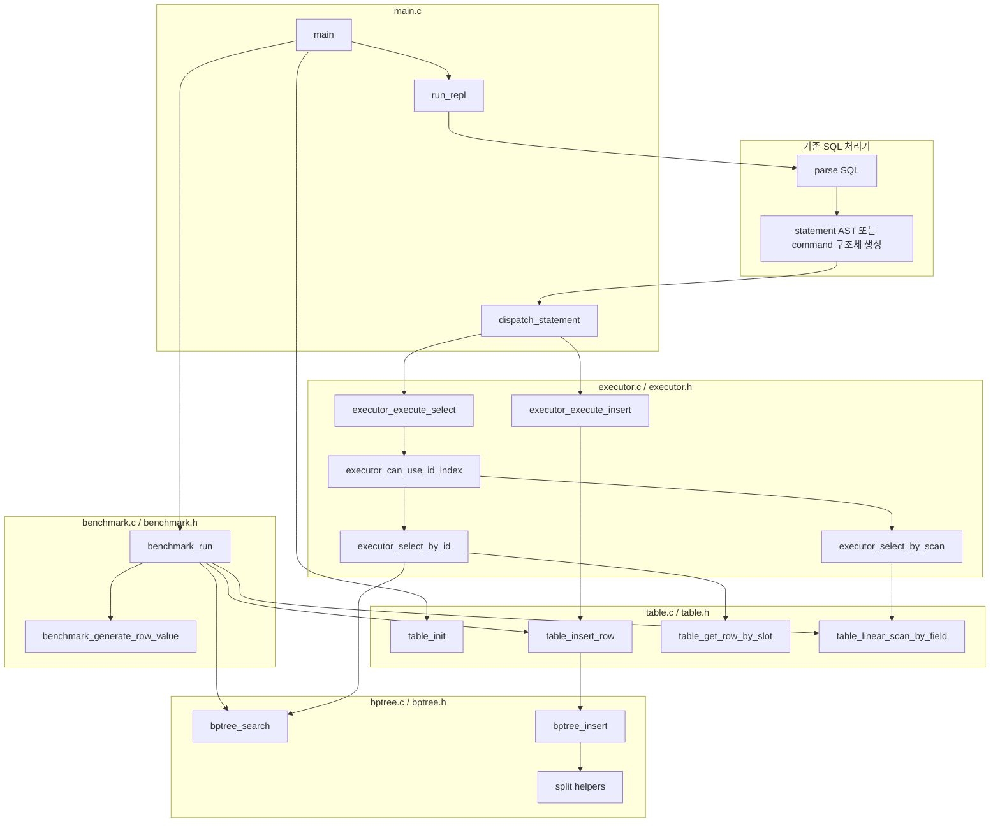

### 10-3. 전체 호출 흐름 그림

이 그림은 “어디서 시작해서 어느 계층으로 내려가는지”만 보여준다. 세부 분할 로직은 다음 그림에서 따로 본다.

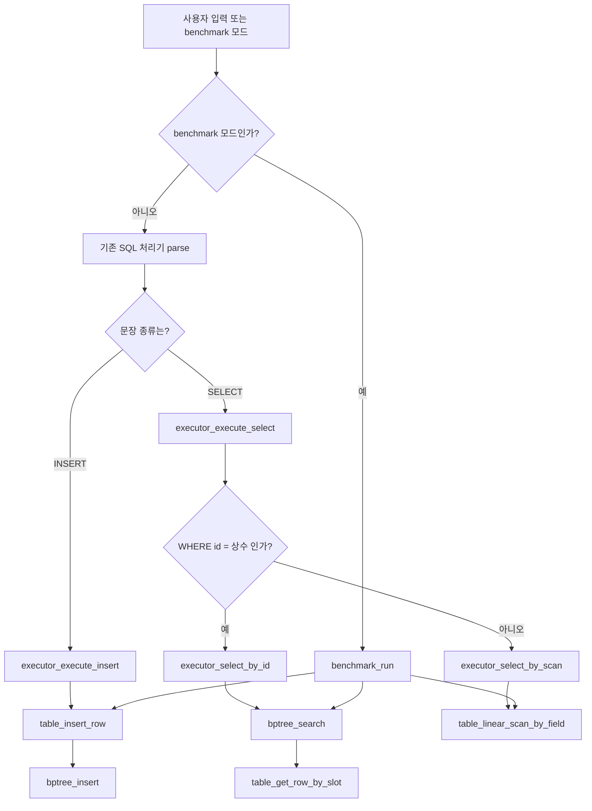

### 10-4. INSERT 경로 그림

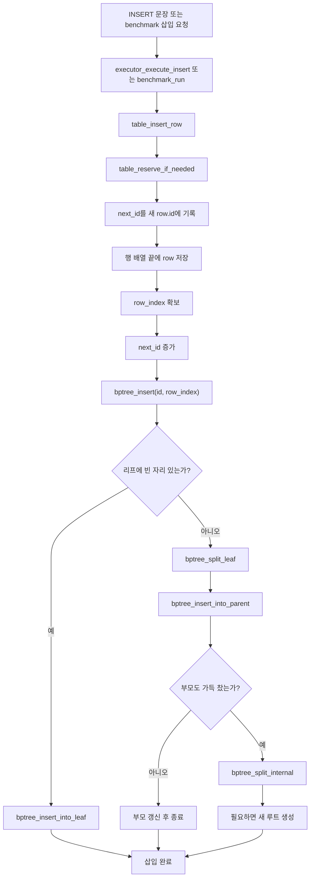

### 10-5. SELECT 경로 그림

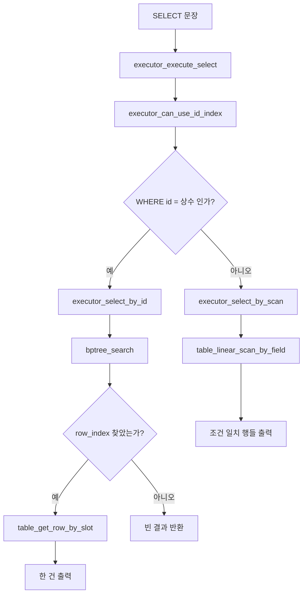

### 10-6. B+ 트리 내부 호출 흐름 그림

이 그림은 B+ 트리 모듈만 떼어 본 것이다. 트리 로직은 여기만 이해하면 된다.

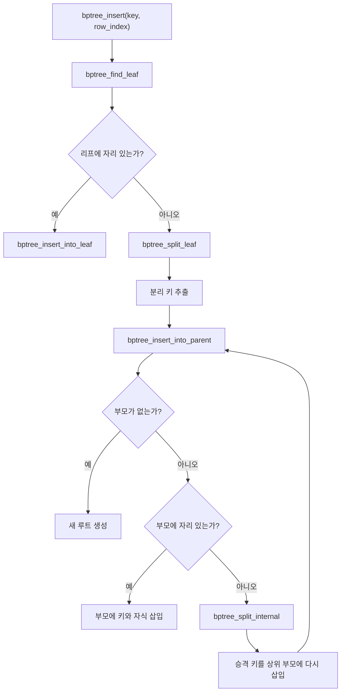

### 10-7. 벤치마크 호출 흐름 그림

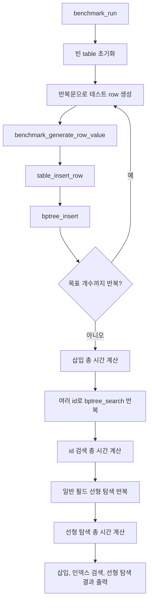

### 10-8. 문서를 읽는 순서 제안

그림이 많아지면 한 번에 다 보려 하지 않는 편이 낫다. 아래 순서로 보면 구조가 가장 빨리 잡힌다.

1. 먼저 `10-3. 전체 호출 흐름 그림`을 본다.
2. 그다음 `10-4. INSERT 경로 그림`과 `10-5. SELECT 경로 그림`을 본다.
3. 마지막으로 `10-6. B+ 트리 내부 호출 흐름 그림`을 보며 분할 전파만 따로 이해한다.

### 10-9. `maxkey = 2` 예시로 보는 `6`, `7` 삽입 시뮬레이션

이 절은 `11`의 자연어 의사 코드를 실제 그림으로 따라가 보기 위한 예시다.  
조건은 아래처럼 고정한다.

1. `maxkey = 2`는 리프와 내부 노드 모두 “키를 최대 2개까지” 가진다는 뜻으로 본다.
2. 시작 상태의 리프는 `[1, 2]`, `[3, 4]` 두 개다.
3. 루트 내부 노드는 키 `[3]` 하나를 가진다.
4. `5`가 없어도 문제는 없다. B+ 트리는 연속된 숫자가 아니라 정렬 순서만 맞으면 된다.
5. 이 시뮬레이션에서는 리프 분할 시 임시 키가 3개가 되면 왼쪽 1개, 오른쪽 2개로 나눈다.
6. 부모에 올리는 키는 “새 오른쪽 리프의 첫 키”로 둔다.
7. 내부 노드 분할 시 키가 3개가 되면 가운데 키를 부모로 승격시키고, 좌우에 나머지 키를 나눈다.

#### 10-9-1. 시작 상태

`1, 2, 3, 4`가 이미 들어간 뒤의 트리를 먼저 고정한다.

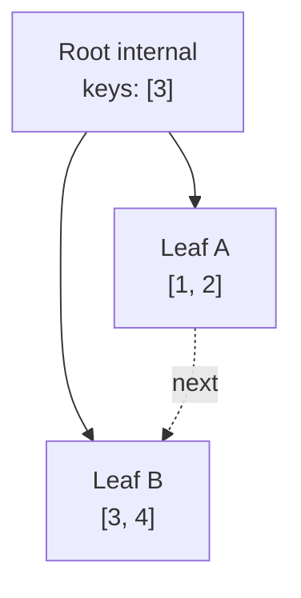

이 상태는 아래 의미를 가진다.

1. `3`보다 작은 키는 왼쪽 리프 `[1, 2]`로 간다.
2. `3` 이상인 키는 오른쪽 리프 `[3, 4]`로 간다.

#### 10-9-2. `6` 삽입에서 호출되는 의사 코드 흐름

이번 삽입에서 따라가는 함수 흐름은 아래와 같다.

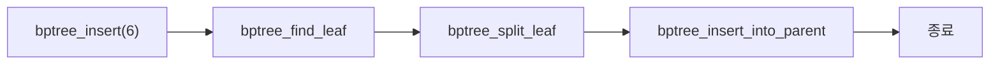

#### 10-9-3. `6` 삽입 Step 1: `bptree_find_leaf`

루트 키 `[3]`와 `6`을 비교하면 `6`은 오른쪽 리프로 내려간다. 따라서 대상 리프는 `[3, 4]`다.

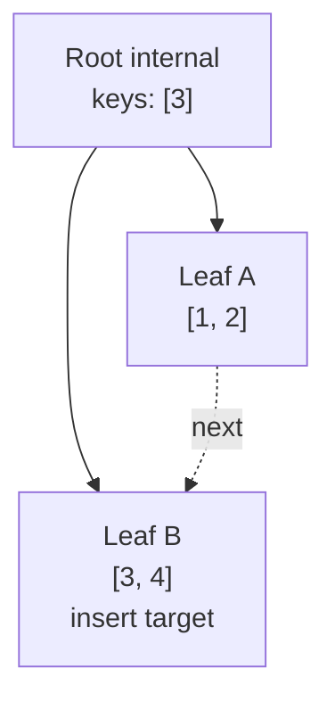

#### 10-9-4. `6` 삽입 Step 2: 리프가 가득 찼으므로 임시 정렬 후 분할 준비

의사 코드의 `bptree_split_leaf`에 따라 기존 키와 새 키를 임시로 모으면 `[3, 4, 6]`이 된다.

#### 10-9-5. `6` 삽입 Step 3: 리프 분할

이 예시 규칙에서는 `[3, 4, 6]`을 왼쪽 `[3]`, 오른쪽 `[4, 6]`으로 나눈다. 그리고 부모에 올릴 분리 키는 새 오른쪽 리프의 첫 키 `4`다.

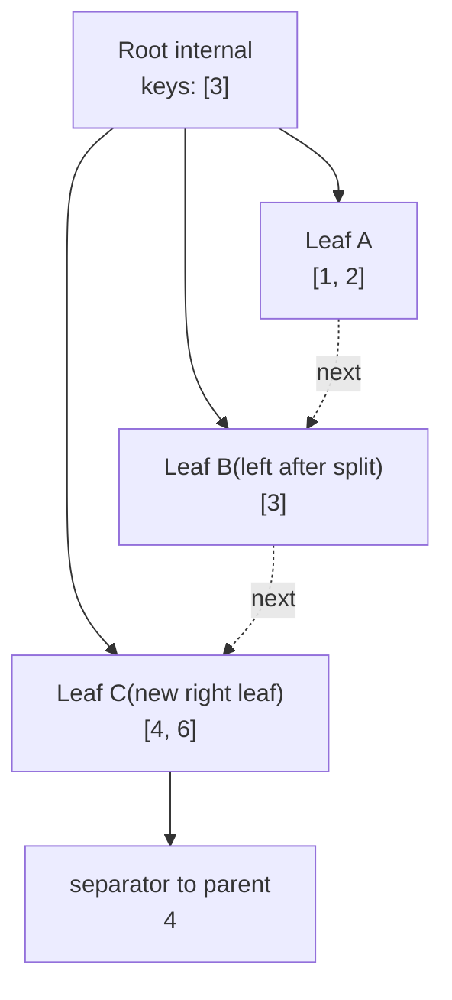

여기서 아직 부모 갱신이 끝난 상태는 아니다. 리프는 쪼개졌지만, 루트 키는 여전히 `[3]`인 중간 상태다.

#### 10-9-6. `6` 삽입 Step 4: `bptree_insert_into_parent`

부모 루트에는 아직 자리 하나가 남아 있으므로 키 `4`를 삽입하면 끝난다. 최종 상태는 아래와 같다.

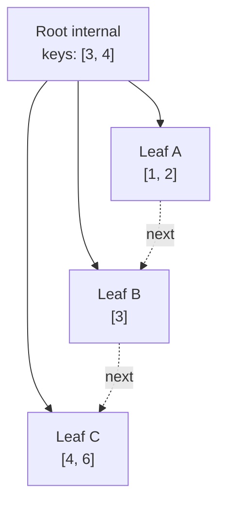

즉 `6` 삽입은 아래 문장으로 요약된다.

1. `bptree_find_leaf`가 `[3, 4]`를 찾는다.
2. 리프가 가득 차 있으므로 `bptree_split_leaf`가 `[3]`, `[4, 6]`으로 나눈다.
3. `bptree_insert_into_parent`가 분리 키 `4`를 루트에 넣는다.
4. 루트는 아직 최대 키 수를 넘지 않으므로 추가 분할 없이 끝난다.

#### 10-9-7. `7` 삽입에서 호출되는 의사 코드 흐름

이번에는 부모도 꽉 차 있기 때문에 호출 흐름이 한 단계 더 깊어진다.

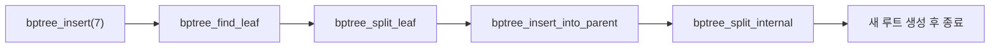

#### 10-9-8. `7` 삽입 Step 1: 현재 시작 상태

`6` 삽입이 끝난 직후의 트리에서 시작한다.

#### 10-9-9. `7` 삽입 Step 2: `bptree_find_leaf`

루트 키 `[3, 4]`와 `7`을 비교하면 `7`은 가장 오른쪽 리프 `[4, 6]`으로 내려간다.

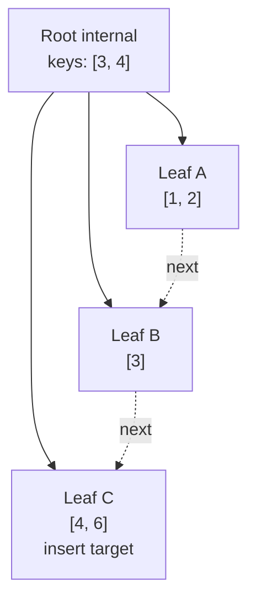

#### 10-9-10. `7` 삽입 Step 3: 리프 오버플로우

대상 리프 `[4, 6]`에 `7`을 넣으면 임시 정렬 결과는 `[4, 6, 7]`이 된다.

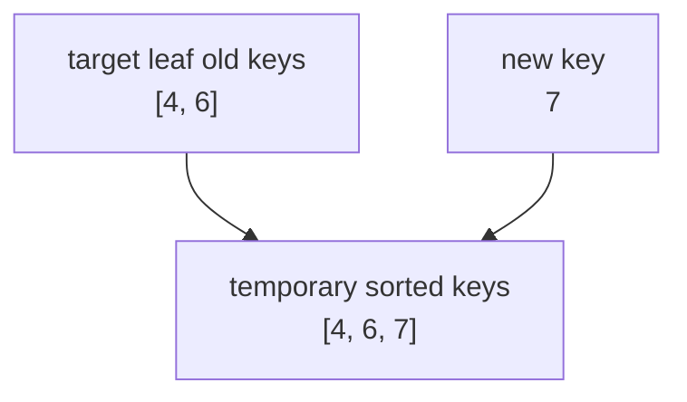

#### 10-9-11. `7` 삽입 Step 4: 리프 분할

이번에도 같은 규칙을 적용해서 왼쪽 `[4]`, 오른쪽 `[6, 7]`로 나눈다. 부모에 올릴 분리 키는 `6`이다.

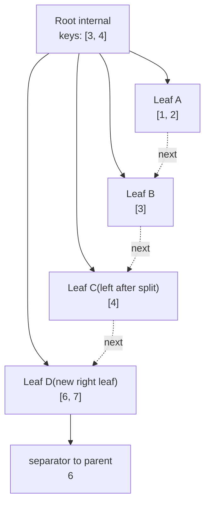

여기서 부모 루트에 `6`을 넣으려 하면 루트 키가 `[3, 4, 6]`이 되어 최대 키 수 `2`를 넘는다.

#### 10-9-12. `7` 삽입 Step 5: 부모 오버플로우 직후의 임시 상태

이 단계는 실제 코드에서 보통 임시 배열로 처리되지만, 이해를 위해 그림으로 적어두면 아래와 같다.

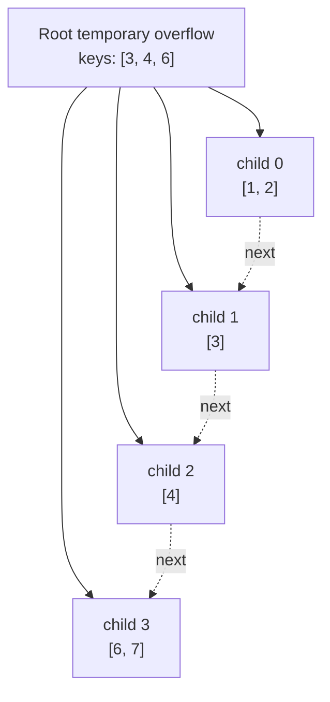

#### 10-9-13. `7` 삽입 Step 6: `bptree_split_internal`

의사 코드의 `bptree_split_internal`에 따라 가운데 키 `4`를 승격시키고, 왼쪽 내부 노드와 오른쪽 내부 노드로 나눈다.

1. 승격 키는 `4`
2. 왼쪽 내부 노드는 키 `[3]`
3. 오른쪽 내부 노드는 키 `[6]`

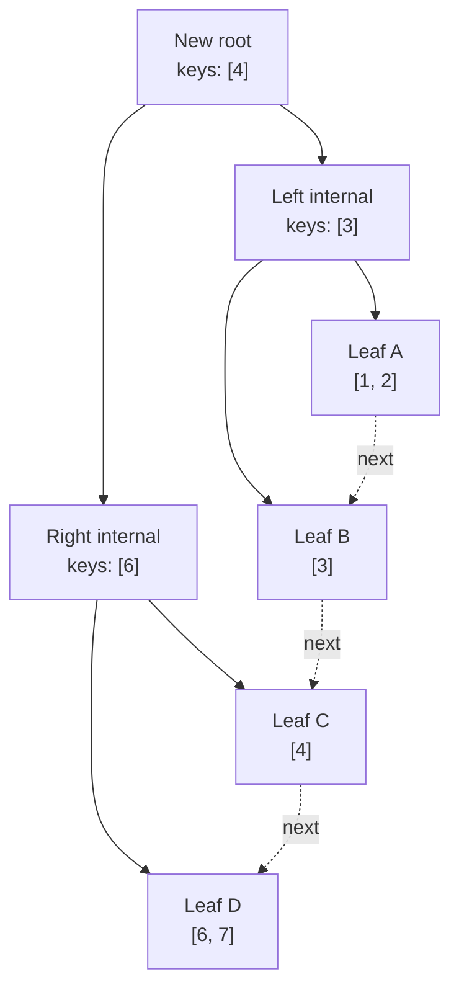

이 그림이 `7` 삽입의 최종 상태다.

#### 10-9-14. `7` 삽입 요약

`7` 삽입은 아래 문장으로 요약된다.

1. `bptree_find_leaf`가 오른쪽 끝 리프 `[4, 6]`를 찾는다.
2. `bptree_split_leaf`가 `[4]`, `[6, 7]`로 나누고 분리 키 `6`을 만든다.
3. `bptree_insert_into_parent`가 루트에 `6`을 넣으려 하지만 루트가 넘친다.
4. `bptree_split_internal`이 루트 임시 키 `[3, 4, 6]`에서 가운데 키 `4`를 승격시킨다.
5. 새 루트 `[4]`가 생기고, 그 아래에 내부 노드 `[3]`, `[6]`이 생긴다.

#### 10-9-15. 이 시뮬레이션으로 읽어야 할 핵심

이 예시에서 꼭 잡아야 할 것은 세 가지다.

1. 리프 분할은 “리프의 실제 데이터 재배치 + 부모에 분리 키 전달”이라는 두 단계로 이해해야 한다.
2. 부모 삽입도 결국 같은 문제이므로, 부모가 넘치면 내부 노드 분할로 재귀적으로 올라간다.
3. `6` 삽입은 리프 분할에서 끝나지만, `7` 삽입은 “리프 분할이 부모 분할까지 전파되는 경우”를 보여준다.

## 11. 함수별 자연어 의사 코드

아래 의사 코드는 실제 C 코드가 아니라, 구현 전에 이해를 맞추기 위한 “문장 형태 알고리즘”이다.

### 11-1. `table_init`

1. 프로그램이 시작되면 비어 있는 테이블 구조체를 만든다.
2. 행 배열의 초기 용량을 작은 값으로 정하고 메모리를 할당한다.
3. 현재 저장된 행 수는 0으로 둔다.
4. 다음에 부여할 `id`는 1로 둔다.
5. B+ 트리 루트는 비어 있는 리프 노드 하나로 준비한다.

### 11-2. `table_reserve_if_needed`

1. 새 행 하나를 넣기 전에 배열에 자리가 남아 있는지 확인한다.
2. 자리가 충분하면 아무 일도 하지 않는다.
3. 자리가 부족하면 기존 용량의 두 배 크기로 새 메모리를 요청한다.
4. 재할당이 성공하면 테이블의 행 배열 포인터와 용량 값을 갱신한다.
5. 재할당이 실패하면 에러를 출력하고 프로그램을 종료한다.

### 11-3. `table_insert_row`

1. 새 행을 넣기 전에 배열 용량을 확인한다.
2. 현재 `next_id` 값을 새 행의 `id`로 기록한다.
3. 일반 필드 값을 새 행 구조체에 복사한다.
4. 새 행을 행 배열의 마지막 위치에 저장한다.
5. 방금 사용한 배열 위치를 행 슬롯 번호로 기억한다.
6. `next_id`를 1 증가시킨다.
7. B+ 트리에 `새 id -> 행 슬롯 번호`를 삽입한다.
8. 삽입이 끝나면 새 행의 `id`와 슬롯 번호를 호출자에게 알려준다.

### 11-4. `table_get_row_by_slot`

1. 요청된 슬롯 번호가 현재 행 수보다 작은지 확인한다.
2. 범위를 벗어나면 잘못된 접근으로 보고 실패를 반환한다.
3. 범위 안이면 해당 위치의 행 주소를 반환한다.

### 11-5. `table_linear_scan_by_field`

1. 첫 번째 행부터 마지막 행까지 순서대로 본다.
2. 각 행의 대상 필드 값을 조건 값과 비교한다.
3. 값이 같으면 결과 목록에 추가하거나 바로 출력한다.
4. 끝까지 다 돌면 전체 결과를 반환한다.

### 11-6. `bptree_create_node`

1. 새 노드 메모리를 할당한다.
2. 이 노드가 리프인지 내부 노드인지 표시한다.
3. 키 개수는 0으로 초기화한다.
4. 부모 포인터는 `NULL`로 둔다.
5. 자식 포인터 배열과 값 배열을 비운다.
6. 리프 노드라면 다음 리프 포인터도 `NULL`로 둔다.

### 11-7. `bptree_find_leaf`

1. 루트 노드에서 시작한다.
2. 현재 노드가 리프 노드가 될 때까지 반복한다.
3. 현재 노드의 키들을 왼쪽부터 보면서, 찾는 키가 어느 구간에 속하는지 판단한다.
4. 해당 구간의 자식 포인터를 따라 아래로 내려간다.
5. 리프 노드에 도달하면 그 노드를 반환한다.

### 11-8. `bptree_search`

1. 먼저 찾고 싶은 `id`가 들어 있을 리프 노드를 찾는다.
2. 그 리프 노드의 키 배열을 왼쪽부터 확인한다.
3. 같은 키를 발견하면 연결된 행 슬롯 번호를 반환한다.
4. 끝까지 봐도 없으면 “찾지 못함”을 반환한다.

### 11-9. `bptree_insert`

1. 삽입할 키가 들어갈 리프 노드를 찾는다.
2. 그 리프 노드에 빈 자리가 있으면 정렬 순서를 유지하면서 키와 값만 끼워 넣는다.
3. 그 리프 노드가 가득 차 있으면 분할을 수행한다.
4. 분할 후 오른쪽 리프의 첫 키를 부모에게 올린다.
5. 부모도 가득 차 있으면 같은 방식으로 내부 노드 분할을 계속 위로 전파한다.
6. 루트가 분할되면 새 루트를 만든다.

### 11-10. `bptree_insert_into_leaf`

1. 리프 노드의 키들 사이에서 새 키가 들어갈 위치를 찾는다.
2. 그 위치 뒤에 있는 키와 값들을 한 칸씩 오른쪽으로 민다.
3. 새 키와 행 슬롯 번호를 그 자리에 넣는다.
4. 키 개수를 하나 증가시킨다.

### 11-11. `bptree_split_leaf`

1. 기존 리프와 새 키를 합치면 몇 개가 되는지 계산한다.
2. 임시 배열에 기존 키들과 새 키를 모두 정렬된 상태로 모은다.
3. 가운데를 기준으로 왼쪽 절반은 기존 리프에 남긴다.
4. 오른쪽 절반은 새 리프 노드로 옮긴다.
5. 새 리프의 `next` 포인터를 기존 리프의 다음 리프로 연결한다.
6. 기존 리프의 `next` 포인터는 새 리프를 가리키게 바꾼다.
7. 새 리프의 첫 키를 부모에 올릴 분리 키로 정한다.
8. 부모가 없으면 새 루트를 만들고, 부모가 있으면 부모 삽입 함수로 넘긴다.

### 11-12. `bptree_insert_into_parent`

1. 왼쪽 자식, 분리 키, 오른쪽 자식 정보를 부모에 넣어야 한다.
2. 부모가 없으면 새 루트를 만든다.
3. 부모가 있으면 분리 키가 들어갈 자리를 찾아 넣는다.
4. 부모에 자리가 있으면 키와 자식 포인터를 삽입하고 끝낸다.
5. 부모가 가득 차 있으면 내부 노드 분할 함수를 호출한다.

### 11-13. `bptree_split_internal`

1. 기존 내부 노드의 키들과 새 분리 키를 임시 배열에 모은다.
2. 가운데 키 하나를 부모로 올릴 승격 키로 정한다.
3. 승격 키보다 작은 쪽 키들과 자식들은 기존 노드에 남긴다.
4. 승격 키보다 큰 쪽 키들과 자식들은 새 내부 노드로 옮긴다.
    TODO. 여기서 이렇게 해석해야 하는거임?? 
        "승격 키보다 큰 키들과, 승격 키보다 크거나 같은 자식들은 새 내부 노드로 옮긴다."
        이게 맞는거지??? 
5. 새로 옮겨간 자식들의 부모 포인터를 새 내부 노드로 다시 설정한다.
6. 승격 키를 부모에 다시 삽입한다.

### 11-14. `executor_execute_insert`

1. SQL 처리기에서 넘어온 `INSERT` 문장을 해석해서 일반 필드 값들을 꺼낸다.
2. 사용자가 `id`를 직접 넣으려고 하면 이번 최소 구현에서는 거부하거나 무시한다.
3. 테이블 삽입 함수를 호출해서 자동 증가 `id`가 붙은 새 행을 저장한다.
4. 결과 메시지에 새 `id`를 포함해 준다.

### 11-15. `executor_can_use_id_index`

1. `WHERE` 조건이 하나인지 확인한다.
2. 연산자가 정확히 `=`인지 확인한다.
3. 왼쪽 피연산자가 `id` 컬럼인지 확인한다.
4. 오른쪽 값이 계산식이 아니라 상수 리터럴인지 확인한다.
5. 네 조건이 모두 맞으면 인덱스 사용 가능이라고 판단한다.

### 11-16. `executor_execute_select`

1. `SELECT` 문장의 `WHERE` 조건을 검사한다.
2. `id` 인덱스를 사용할 수 있으면 인덱스 검색 경로를 탄다.
3. 인덱스를 쓸 수 없으면 선형 탐색 경로를 탄다.
4. 검색된 행들을 기존 출력 형식에 맞춰 보여 준다.

### 11-17. `executor_select_by_id`

1. 조건 값에서 찾고 싶은 `id`를 읽는다.
2. B+ 트리 검색 함수로 행 슬롯 번호를 찾는다.
3. 찾은 슬롯 번호로 실제 행을 꺼낸다.
4. 행이 있으면 한 건을 출력한다.
5. 행이 없으면 빈 결과를 출력한다.

### 11-18. `executor_select_by_scan`

1. 조건에서 비교 대상 필드와 비교 값을 읽는다.
2. 테이블 전체를 순회하면서 필드 값을 비교한다.
3. 조건을 만족하는 행을 모두 출력한다.

### 11-19. `benchmark_generate_row_value`

1. 반복 인덱스를 받아서 예측 가능한 테스트 값을 만든다.
2. 예를 들면 `user_1`, `user_2`, `user_3` 같은 이름을 만든다.
3. 나중에 같은 값을 다시 조회할 수 있도록 규칙이 단순해야 한다.

### 11-20. `benchmark_run`

1. 벤치마크용 빈 테이블을 초기화한다.
2. 목표 개수만큼 테스트 행을 생성해서 삽입한다.
3. 삽입 시작 시각과 종료 시각을 기록해 총 삽입 시간을 구한다.
4. 여러 개의 테스트 `id` 값을 골라 인덱스 검색을 반복한다.
5. 같은 횟수만큼 일반 필드 검색도 반복한다.
6. 각 검색의 총 시간을 기록한다.
7. 최종적으로 삽입 시간, 인덱스 검색 시간, 선형 탐색 시간을 한 번에 출력한다.

## 12. 구현 순서 제안

### 1단계. 기존 SQL 처리기의 접점 찾기

1. 현재 SQL 처리기가 어떤 형태의 문장 구조를 넘겨주는지 확인한다.
2. `INSERT`와 `SELECT`가 실제로 어떤 함수로 분기되는지 확인한다.
3. 이번 과제에서 손댈 진입점을 정확히 하나로 정한다.

### 2단계. 테이블 저장소 완성

1. 행 구조체와 테이블 구조체를 만든다.
2. 자동 증가 `id`가 붙는 삽입 함수를 만든다.
3. 아직 인덱스 없이도 삽입과 조회가 되는지 확인한다.

### 3단계. B+ 트리 단독 동작 완성

1. 리프 노드 삽입과 검색을 먼저 만든다.
2. 리프 분할을 구현한다.
3. 내부 노드 분할을 구현한다.
4. 루트 분할까지 확인한다.
5. 작은 테스트 데이터로 모든 키가 정확히 다시 찾아지는지 확인한다.

### 4단계. 테이블과 B+ 트리 연결

1. 행 삽입 직후 `id -> row_index`를 인덱스에 넣는다.
2. `SELECT WHERE id = 값` 경로를 인덱스 검색으로 연결한다.
3. 결과가 기존 출력 형식과 맞는지 확인한다.

### 5단계. 인덱스 분기 로직 연결

1. `WHERE id = 상수`인지 판단하는 함수를 만든다.
2. 이 조건이면 인덱스 검색 경로를 사용한다.
3. 아니면 선형 탐색 경로를 사용한다.

### 6단계. 벤치마크 추가

1. 100만 건 이상을 넣는 별도 실행 모드를 만든다.
2. 삽입 시간과 조회 시간을 각각 측정한다.
3. 인덱스 검색과 일반 필드 검색 결과를 나란히 출력한다.

### 7단계. 마지막 검증

1. 작은 데이터에서 정답이 맞는지 확인한다.
2. 노드 분할 이후에도 검색이 모두 맞는지 확인한다.
3. 100만 건 벤치마크가 끝까지 완료되는지 확인한다.
4. 팀원이 핵심 함수 흐름을 설명할 수 있는지 점검한다.

## 13. 테스트 시나리오

### 기능 테스트

1. 첫 번째 `INSERT`에서 `id = 1`이 부여되는지 확인한다.
2. 세 번 `INSERT`한 뒤 `id = 2` 조회가 정확히 두 번째 행을 찾는지 확인한다.
3. 존재하지 않는 `id`를 조회하면 빈 결과가 나오는지 확인한다.
4. 일반 필드 조회가 선형 탐색으로도 정답을 찾는지 확인한다.
5. 리프 분할이 발생할 만큼 많은 데이터를 넣은 뒤에도 모든 `id`가 다시 검색되는지 확인한다.
6. 루트 분할이 발생한 뒤에도 검색 정합성이 유지되는지 확인한다.

### 성능 테스트

1. 1,000,000개 이상의 행이 삽입 중간에 깨지지 않고 끝까지 들어가는지 확인한다.
2. 같은 횟수의 조회에서 `id` 인덱스 검색이 일반 필드 선형 탐색보다 빠른지 확인한다.
3. 결과를 총 시간과 평균 시간 둘 다 출력해 비교가 쉽게 보이게 한다.

## 14. 구현 시 주의할 점

1. 행 포인터를 인덱스 값으로 저장하면 재할당 이후 깨질 수 있으므로 슬롯 번호를 저장한다.
2. 내부 노드와 리프 노드의 역할을 섞으면 B+ 트리가 아니라 B-트리 비슷한 코드가 되므로 분리를 명확히 한다.
3. 부모 포인터를 유지하지 않으면 분할 전파 코드가 더 복잡해지므로 부모 포인터를 두는 편이 낫다.
4. 이번 과제에서는 삭제를 빼므로 병합 로직을 억지로 넣지 않는다.
5. 벤치마크는 파서 성능이 아니라 인덱스 성능을 보여주는 자리라는 점을 계속 유지한다.
6. 코드 주석은 분할 로직처럼 헷갈릴 수 있는 곳에만 짧게 단다.

## 15. 구현 전에 팀이 합의하면 좋은 문장

1. 우리는 “정확 일치 `id` 검색이 되는 메모리 기반 B+ 트리 인덱스”를 먼저 끝낸다.
2. 우리는 “일반 필드 검색까지 인덱싱하는 DBMS”를 만들지 않는다.
3. 우리는 “자동 증가 `id`, B+ 트리 등록, `WHERE id = 값` 최적화, 100만 건 비교” 이 네 가지를 최소 합격선으로 본다.

## 16. 구현 시작 직전 체크리스트

1. 이전 차수 SQL 처리기의 `INSERT`와 `SELECT` 진입 함수를 확인했는가
2. 자동 증가 `id`를 어디에 저장할지 정했는가
3. 인덱스 값으로 `row_index`를 쓰기로 합의했는가
4. `WHERE id = 상수` 판별 규칙을 정했는가
5. 벤치마크는 별도 모드로 돌리기로 합의했는가
6. 이번 1차 범위에서 삭제와 범위 검색을 제외하기로 합의했는가

## 17. 이 계획대로 만들었을 때 기대되는 결과물

이 계획대로 구현하면, 복잡한 DBMS 기능은 과감히 버리면서도 과제의 핵심 명세는 모두 충족하는 결과물이 나온다. 팀은 “행 저장”, “자동 id 부여”, “B+ 트리 삽입과 검색”, “SQL 실행 시 인덱스 분기”, “100만 건 성능 비교”라는 다섯 덩어리만 이해하면 전체 동작을 설명할 수 있다. 즉, 확장성보다 단순함을 우선하면서도 “이 과제를 했다”고 말할 수 있는 가장 작은 완성형에 가깝다.
