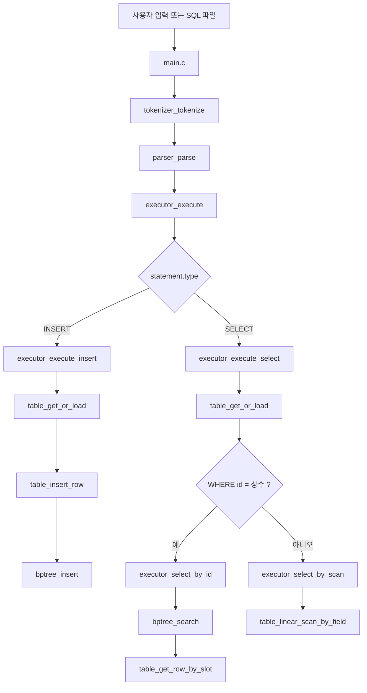
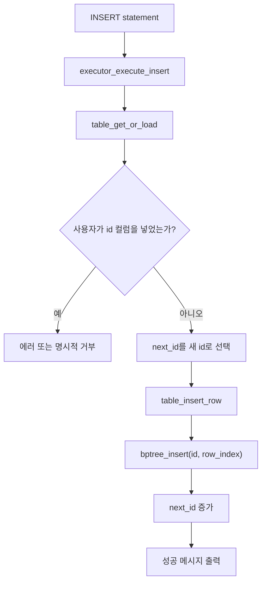
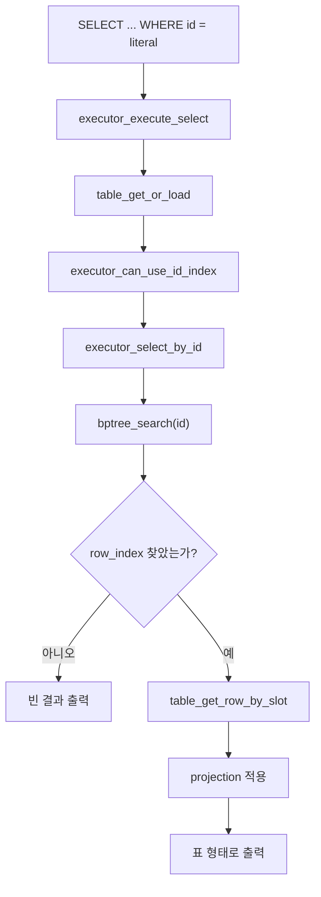
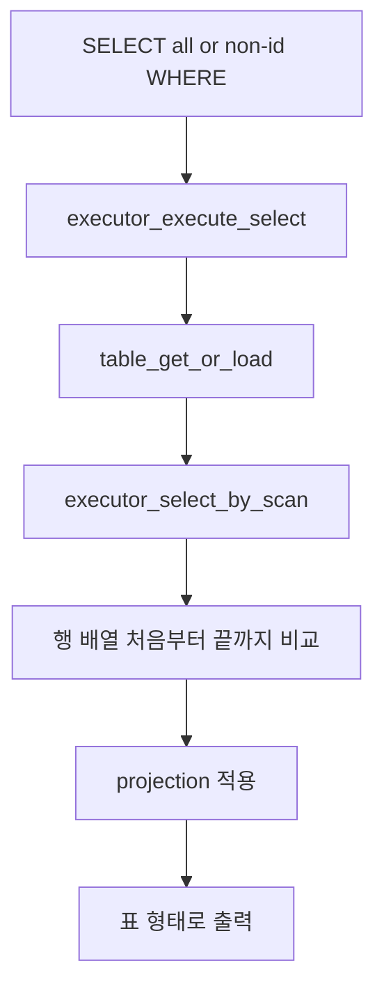
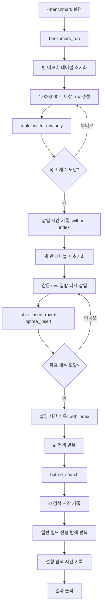

# week6_group1_sql 기반 B+ Tree 통합 계획
# 구현 규칙
- 이 문서에서 정의하고 만든 함수들과 아예 무관한 실행 흐름을 가지는 별도의 함수를 생성해서는 안 된다.
- 이 문서에서 정의하고 만든 의사 코드대로의 함수들을 의사 코드에 맞도록 구현해야 한다.
- 코드는 항상 깔끔하게 유지한다. Doxygen 스타일을 유지한다.
- 구현된 코드는 항상 간결함을 우선으로 한다. 확장성이나 기능 추가보다 사람이 읽기 편하고, 읽을 양이 적은 코드를 생성해야 함을 명심하라.

## 1. 이 문서의 목적

이 문서는 기존 [plan.md](/Users/sisu/Projects/jungle/WEDCodingDay/week8_BPTREE/plan.md:1)의 추상 계획을, 실제 SQL 처리기 저장소 `https://github.com/Y-duchi/week6_group1_sql` 구조에 맞춰 다시 쓴 “현실적인 구현 계획”이다.

핵심 원칙은 그대로 유지한다.

1. 확장성보다 단순함을 우선한다.
2. 있어도 좋은 기능은 빼고, 과제 핵심만 정확히 넣는다.
3. 기존에 만든 자연어 의사 코드는 유지한다.
4. 구현은 이 문서에서 하지 않는다. 이 문서는 설계와 작업 순서만 다룬다.

## 2. 실제 저장소를 보고 확인한 현재 구조

이 저장소는 이미 “SQL 문자열 -> tokenizer -> parser -> executor -> storage” 흐름이 완성되어 있다.

### 현재 핵심 파일

1. `src/main.c`
2. `src/tokenizer.c`, `src/tokenizer.h`
3. `src/parser.c`, `src/parser.h`
4. `src/executor.c`, `src/executor.h`
5. `src/storage.c`, `src/storage.h`
6. `src/index.c`, `src/index.h`
7. `src/utils.c`, `src/utils.h`

### 현재 실제 동작

1. `main.c`는 REPL 모드와 `.sql` 파일 실행 모드를 제공한다.
2. `tokenizer.c`는 SQL을 토큰 배열로 만든다.
3. `parser.c`는 토큰 배열을 `SqlStatement` 구조체로 바꾼다.
4. `executor.c`는 현재 `INSERT`, `SELECT`, `DELETE`를 실행한다.
5. `storage.c`는 CSV 파일을 읽고 쓰는 저장 계층이다.
6. `index.c`는 현재 B+ 트리가 아니라 “조회할 때마다 새로 만드는 임시 해시/정렬 인덱스”다.

### 현재 구조에서 중요한 사실

#### 사실 1. `main.c`와 파서 계층은 이미 충분히 쓸 만하다

이 부분은 과제 핵심이 아니다. 따라서 크게 건드리지 않는 것이 맞다.

#### 사실 2. 기존 저장 계층에도 auto-increment 아이디어는 있다

현재 `storage.c`는 `id` 컬럼이 있고 사용자가 `INSERT`에서 `id`를 생략하면 다음 `id`를 계산해서 넣는다.  
다만 이번 과제에서는 이 로직을 그대로 재사용하기보다, 메모리 런타임 쪽이 `next_id`를 직접 관리하는 쪽이 GOAL과 더 잘 맞는다.

#### 사실 3. 현재 `SELECT WHERE ...`는 과제 명세와 안 맞는다

현재 `executor.c`는 `WHERE`가 있으면 컬럼이 무엇이든 `index_build()`를 호출해서 임시 인덱스를 만든다.  
하지만 이번 과제는 아래처럼 가야 한다.

1. `WHERE id = 값`만 B+ 트리 사용
2. 다른 필드 검색은 선형 탐색
3. 인덱스는 삽입 시점에 유지되어야 함

#### 사실 4. 현재 저장소는 CSV 파일 기반이지만, 과제의 핵심 결과물은 메모리 기반이어야 한다

여기서 중요한 판단은 “기존 SQL 처리기의 어디까지 재사용하느냐”다.

이번 문서에서는 GOAL 기준을 우선해서 아래처럼 정리한다.

1. `main.c`, `tokenizer.c`, `parser.c`, `executor.c`의 SQL 처리 흐름은 재사용한다.
2. 실제 테이블 상태와 인덱스의 기준 데이터는 메모리 런타임이 가진다.
3. `storage.c`는 주 실행 경로의 필수 요소가 아니라, 필요하면 참고하거나 일부 헬퍼만 재사용하는 보조 계층으로 내린다.

즉 이번 결과물의 “DB 정보 자체”는 메모리에 있고, CSV는 핵심 축이 아니다.

## 3. 현재 저장소와 과제 요구 사이의 차이

현재 저장소는 좋은 출발점이지만, 그대로는 과제 핵심을 만족하지 못한다.

### 지금 없는 것

1. `id` 전용 B+ 트리
2. 삽입 시점에 유지되는 인덱스
3. `WHERE id = 상수`만 인덱스를 쓰는 분기
4. 비-`id` 필드 조회를 선형 탐색으로 강제하는 경로
5. 100만 건 이상 메모리 기준 벤치마크

### 지금 있는데 바꿔야 하는 것

1. `index.c`의 임시 해시/정렬 인덱스 방식
2. `executor.c`의 “WHERE가 있으면 일단 인덱스”라는 흐름

### 지금 있는데 유지할 것

1. `main.c`의 REPL / file mode
2. `tokenizer.c`
3. `parser.c`
4. 테스트 프레임

## 4. 이번 계획의 핵심 전략

### 한 줄 전략

기존 SQL 처리기의 앞단은 그대로 두고, `executor` 뒤에 “메모리 기반 테이블 런타임 + id 전용 B+ 트리”를 넣는다.

### 실제 선택

1. 파서와 토크나이저는 그대로 둔다.
2. `main.c`의 REPL / file mode도 그대로 둔다.
3. 새로 “메모리 런타임 테이블” 계층을 추가하고, 이 계층을 실제 데이터의 기준으로 삼는다.
4. B+ 트리 모듈은 `src/bptree.c/h`로 새로 만든다.
5. `SELECT WHERE id = 상수`만 B+ 트리를 사용한다.
6. `SELECT WHERE 다른필드 ...`는 선형 탐색을 사용한다.
7. `DELETE`는 이번 범위에서 아예 제외한다.
8. 벤치마크는 파서와 디스크 I/O를 빼고 메모리 구조만 측정한다.
9. 벤치마크에는 “인덱스 있는 삽입”과 “인덱스 없는 삽입” 비교도 넣는다.

이렇게 바꾸는 이유는 명확하다.

1. `GOAL.md`에는 `DELETE` 요구가 없다.
2. 이번 과제의 핵심은 “메모리 기반 테이블 + 자동 `id` + B+ 트리 + 검색/삽입 비교”다.
3. `storage.c`를 중심에 두면 과제 핵심보다 CSV 호환성이 더 커진다.

## 5. 설계 판단

### 판단 1. auto-id는 메모리 런타임이 직접 관리한다

executor 상위 계층에서는 `id`를 직접 넣지 못하게 하는 편이 가장 단순하다.

즉 정책은 이렇게 잡는다.

1. SQL 사용자 입장에서는 `id`를 직접 넣지 않는다.
2. 메모리 런타임이 다음 `id`를 계산한다.
3. 런타임 테이블 끝에 새 행을 append한다.
4. append 직후 `bptree_insert(id, row_index)`를 호출한다.

이 방식의 장점은 아래와 같다.

1. 데이터 기준점이 메모리 한 곳으로 모인다.
2. `storage.c`의 규칙과 메모리 런타임의 규칙이 충돌하지 않는다.
3. 삽입 성능 비교에서 디스크 I/O를 완전히 뺄 수 있다.

### 판단 2. 런타임 캐시는 “활성 테이블 하나만” 유지한다

현재 SQL 처리기는 한 문장에 한 테이블만 다룬다. 따라서 최소 구현에서는 다중 테이블 캐시까지 가지 않는다.

정책은 아래처럼 둔다.

1. 현재 메모리에 올라와 있는 활성 테이블이 하나 있다.
2. 다른 테이블을 조회하면 기존 활성 테이블을 해제하고 새 빈 런타임을 잡는다.
3. 복수 테이블 동시 캐시는 넣지 않는다.

이 선택은 성능보다 단순함을 우선한 것이다.

### 판단 3. B+ 트리 값은 `row_index`를 쓴다

현재 저장소는 CSV 오프셋도 제공하지만, 메모리 런타임을 도입하면 B+ 트리 값은 `row_index`가 더 단순하다.

이유는 아래와 같다.

1. 조회 시 이미 메모리 안의 행 배열을 가지고 있다.
2. `row_index`는 `rows[row_index]`로 바로 접근할 수 있다.
3. 동적 배열이 재할당되어도 인덱스 값은 그대로 유지된다.
4. 이번 범위에는 삭제가 없으므로 `row_index` 정합성을 삽입 전용 규칙으로 단순하게 유지할 수 있다.

### 판단 4. 기존 generic `index.c`는 유지하지 않고, B+ 트리는 새 파일로 분리한다

현재 `index.c`의 해시/범위 인덱스는 이번 과제의 핵심이 아니다. 오히려 남겨 두면 코드가 더 헷갈린다.

따라서 방향은 아래 중 하나여야 한다.

1. `src/index.c/h` 파일 이름은 유지하되 내용은 B+ 트리로 교체
2. `src/bptree.c/h`를 새로 만들고 기존 `index.c/h`는 퇴역 또는 미사용 처리

이번 계획에서는 **2번을 채택한다**.

이유는 아래와 같다.

1. 기존 `index.c`는 “쿼리 때마다 만드는 임시 인덱스”라는 의미가 강하다.
2. 새 B+ 트리는 역할이 완전히 다르므로 파일도 분리하는 편이 읽기 쉽다.
3. 팀 설명 시 `table_runtime.c`와 `bptree.c`라는 구조가 훨씬 직관적이다.

### 판단 5. `DELETE`는 이번 계획에서 완전히 제외한다

이 결정은 GOAL 기준에 맞춘 범위 축소다.

1. 과제 요구사항에 `DELETE`는 없다.
2. `DELETE`를 살리면 B+ 트리 삭제, row slot 정합성, 런타임 invalidate 같은 주변 설계가 따라온다.
3. 그 주변 설계는 이번 과제 합격선에 기여하지 않는다.

따라서 이번 계획에서는 아래처럼 정리한다.

1. 구현 목표에서 `DELETE`를 제외한다.
2. `executor.c`에 기존 `DELETE` 코드가 남아 있어도 새 기능 범위에는 포함하지 않는다.
3. 테스트와 벤치마크에서도 `DELETE`는 다루지 않는다.

### 판단 6. 벤치마크는 메모리 기준으로 돌린다

기존 저장소가 CSV 기반이라 디스크 I/O가 너무 많이 섞이면 B+ 트리 비교가 흐려진다.

따라서 벤치마크는 아래 기준으로 간다.

1. 파서 비용 제외
2. CSV 파일 I/O 제외
3. 같은 메모리 행 집합에 대해
4. `id`는 B+ 트리 검색
5. 일반 필드는 선형 탐색

이렇게 해야 “자료구조 차이”가 뚜렷하게 보인다.

## 6. 실제 파일별 계획

## 6-1. `src/main.c`

이 파일은 거의 유지한다.

### 유지할 부분

1. REPL 루프
2. file mode
3. `main_process_sql_statement()`
4. `tokenizer -> parser -> executor` 흐름

### 추가할 부분

1. `--benchmark` 또는 `benchmark` 같은 특수 실행 모드
2. 프로그램 종료 시 메모리 런타임 정리 호출

### 이 파일의 새 역할

`main.c`는 여전히 진입점일 뿐이다. B+ 트리나 테이블 로직은 여기 넣지 않는다.

## 6-2. `src/executor.c`, `src/executor.h`

이 파일이 가장 중요한 변경 지점이다.

### 현재 문제

현재는 `WHERE`가 있으면 `executor_collect_indexed_rows()`가 모든 컬럼에 대해 임시 인덱스를 만든다.

### 새 역할

이제 `executor.c`는 아래 분기만 책임진다.

1. `INSERT`면 메모리 런타임 삽입 + B+ 트리 등록
2. `SELECT WHERE id = 상수`면 B+ 트리 검색
3. `SELECT`의 나머지 경우는 선형 탐색

### 추가 또는 유지할 함수 후보

1. `executor_execute`
2. `executor_execute_insert`
3. `executor_execute_select`
4. `executor_can_use_id_index`
5. `executor_select_by_id`
6. `executor_select_by_scan`
7. 기존 표 출력 헬퍼들

## 6-3. `src/storage.c`, `src/storage.h`

이 파일은 이번 구현의 중심이 아니라, 필요하면 참고하거나 일부 유틸리티를 재사용하는 후보로만 둔다.

### 유지할 부분

1. 기존 CSV 파싱/테이블 표현 참고
2. 문자열/행 메모리 처리 방식 참고
3. 정말 필요할 때만 일부 헬퍼 재사용

### 바꾸지 않는 이유

과제 핵심은 SQL 문법이나 CSV 파서가 아니라 B+ 트리와 실행 경로다.

여기서 trade-off는 분명하다.

1. `storage.c`를 주 경로에 두면 기존 코드 재사용은 늘지만, “메모리 기반 DB”라는 목표가 흐려진다.
2. `storage.c`를 완전히 걷어내면 설계는 더 깔끔해지지만, 기존 repo와의 연결 지점이 줄어든다.
3. 이번 GOAL 기준에서는 깔끔함과 명세 정합성이 더 중요하므로, 주 경로에서는 `storage.c`를 내리는 편이 맞다.

“주변이 더 커진다”는 뜻은 구체적으로 아래를 말한다.

1. 한 번의 `INSERT`에서 메모리 행 append와 CSV 쓰기 둘 다 맞춰야 한다.
2. `next_id`의 기준이 메모리와 파일 두 곳으로 늘어난다.
3. 실패 처리도 “메모리 성공/파일 실패” 같은 이중 상태를 다뤄야 한다.
4. 벤치마크에서 자료구조 성능이 아니라 파일 I/O 잡음이 섞인다.

반대로 `storage.c`를 주 경로에서 빼면 얻는 장점은 아래와 같다.

1. 런타임 테이블이 유일한 상태 저장소가 된다.
2. `INSERT -> append -> bptree_insert`만 보면 되므로 설명이 훨씬 단순하다.
3. 벤치마크가 정확히 “인덱스가 붙은 메모리 자료구조의 비용”을 보여준다.

따라서 이 문서에서는 `storage.c`를 핵심 경로에서 제외하는 쪽으로 수정한다.

### 이 파일의 새 위치

즉 `storage.c`는 필요시 참고 가능한 레거시 모듈이고, 이번 결과물의 실행 중심은 아니다.

## 6-4. `src/bptree.c`, `src/bptree.h`

이 파일군은 새 B+ 트리 모듈이다.

### 분리 이유

1. 기존 `src/index.c/h`는 equality/range 임시 인덱스 용도다.
2. 새 B+ 트리는 삽입 시 유지되는 영속적 메모리 인덱스다.
3. 두 역할을 같은 파일에 섞지 않는 편이 문서와 코드 모두 더 명확하다.

### 새 역할

1. 정수 `id` 전용 B+ 트리
2. 값은 `row_index`
3. 메모리 기반 삽입/검색
4. 리프 분할과 내부 노드 분할

### 이 파일에 둘 함수

1. `bptree_create_node`
2. `bptree_find_leaf`
3. `bptree_search`
4. `bptree_insert`
5. `bptree_insert_into_leaf`
6. `bptree_split_leaf`
7. `bptree_insert_into_parent`
8. `bptree_split_internal`
9. `bptree_free`

즉 함수명은 기존 의사 코드를 그대로 따른다. 단, 실제 파일은 `src/bptree.c/h`에 둔다.

## 6-5. `src/table_runtime.c`, `src/table_runtime.h`

이 파일은 새로 추가하는 것이 좋다.

### 새 역할

1. 활성 테이블 하나를 메모리에 유지
2. 런타임 테이블을 메모리 기준 데이터로 보관
3. 다음 auto-id 계산
4. 행 배열 관리
5. `id` B+ 트리 루트 보관
6. 선형 탐색 제공

### 이 파일에 둘 함수

1. `table_init`
2. `table_free`
3. `table_reserve_if_needed`
4. `table_get_or_load`
5. `table_insert_row`
6. `table_get_row_by_slot`
7. `table_linear_scan_by_field`

이렇게 하면 기존 의사 코드의 `table_*` 함수 이름을 유지할 수 있다.

## 6-6. `src/benchmark.c`, `src/benchmark.h`

이 파일은 별도로 추가한다.

### 역할

1. 대량 행 생성
2. 메모리 기반 삽입
3. `id` B+ 트리 조회 반복
4. 일반 필드 선형 탐색 반복
5. 인덱스 포함 삽입과 인덱스 없는 삽입 비교
6. 시간 측정과 결과 출력

이 벤치마크는 최소 세 가지 수치를 출력해야 한다.

1. `insert_without_index`
2. `insert_with_bptree_index`
3. `select_by_id_with_index` 대 `select_by_other_field_linear_scan`

### 함수

1. `benchmark_generate_row_value`
2. `benchmark_run`

## 6-7. `Makefile`

현재 `Makefile`은 `src/*.c`를 자동으로 빌드하므로, `src/table_runtime.c`와 `src/benchmark.c`를 추가해도 큰 수정은 필요 없을 가능성이 높다.

필요한 최소 확인만 하면 된다.

1. 새 파일이 자동으로 빌드되는지
2. 테스트 바이너리 링크에 중복 심볼이 없는지

## 7. 실제 데이터 구조

## 7-1. `TableRuntime`

가장 단순한 방향은 기존 `TableData` 형식을 최대한 재사용하는 것이다.

권장 구조는 아래와 같다.

```c
typedef struct {
    char table_name[MAX_IDENTIFIER_LEN];
    int col_count;
    char columns[MAX_COLUMNS][MAX_IDENTIFIER_LEN];
    char ***rows;
    int row_count;
    int capacity;
    int id_column_index;
    long long next_id;
    BPTreeNode *id_index_root;
    int loaded;
} TableRuntime;
```

### 이 구조를 고르는 이유

1. 기존 repo는 이미 `char*** rows` 형식으로 행을 다룬다.
2. 새로운 고정 길이 `Row` 구조체를 만들면 기존 executor 출력 코드와 멀어진다.
3. 컬럼 개수 가변이라는 현재 SQL 처리기 특성을 그대로 유지할 수 있다.
4. B+ 트리 값은 `row_index` 하나면 충분하다.

추가로 이 구조를 택했을 때의 현실적인 메모리 감각은 아래처럼 본다.

1. 100만 건에 `id + name 1개` 정도만 있어도 런타임 메모리는 대략 100MB 안팎까지 갈 수 있다.
2. 그래서 벤치마크는 “가능한 적은 컬럼”으로 고정하는 편이 좋다.
3. 설명 가능성과 구현 속도를 우선하면, 이번 과제에서는 이 정도 메모리 사용은 감수할 만하다.

## 7-2. `BPTreeNode`

키는 정수 `id`, 값은 `row_index`다.

```c
typedef struct BPTreeNode {
    int is_leaf;
    int key_count;
    int keys[BPTREE_MAX_KEYS];
    struct BPTreeNode *parent;
    struct BPTreeNode *children[BPTREE_MAX_KEYS + 1];
    int row_indices[BPTREE_MAX_KEYS];
    struct BPTreeNode *next;
} BPTreeNode;
```

### 주의

1. 내부 노드에서는 `row_indices`를 쓰지 않는다.
2. 리프 노드에서는 `children`을 쓰지 않는다.
3. 하지만 구현 단순화를 위해 구조체 하나로 통일하는 편이 낫다.

## 7-3. 활성 테이블 정책

최소 구현에서는 아래처럼 간다.

1. 현재 활성 테이블 이름이 있으면 그것을 메모리에 유지한다.
2. 새 statement가 다른 테이블을 가리키면 기존 활성 테이블을 해제한다.
3. 아직 활성 테이블이 없으면 빈 `TableRuntime`을 만들고 이후 `INSERT`를 받는다.

## 8. 전체 호출 구조

### 8-1. 실제 repo 기준 큰 그림



### 8-2. 현재 repo에서 실제로 바뀌는 중심점

실제 핵심 교체 지점은 두 군데다.

1. 현재 `executor_collect_indexed_rows()` 경로를 제거 또는 대체
2. 현재 generic `index_build()` 계열을 제거하고 B+ 트리 호출로 대체

## 9. 세부 동작 흐름

## 9-1. 런타임 테이블 로드 흐름

1. executor가 테이블 이름을 받는다.
2. 현재 활성 런타임이 같은 테이블이면 그대로 쓴다.
3. 아니면 기존 런타임을 해제하고 새 빈 런타임을 만든다.
4. 컬럼 정보는 첫 `INSERT` 또는 초기화 시점에 확정한다.
5. `id` 컬럼 위치를 기록한다.
6. `next_id`를 1로 시작한다.

## 9-2. INSERT 흐름



### 이 경로의 장점

1. 데이터 기준점이 메모리 하나로 통일된다.
2. 삽입 직후 B+ 트리에 등록된다는 요구를 충족한다.
3. 삽입 성능 비교에서 디스크 영향이 사라진다.

## 9-3. `SELECT WHERE id = ?` 흐름



## 9-4. `SELECT`의 나머지 흐름

여기서 “나머지”는 두 가지다.

1. `WHERE`가 없음
2. `WHERE`는 있지만 `id = 상수`가 아님

이 둘은 모두 선형 탐색으로 간다.



## 9-5. DELETE는 이번 범위에서 다루지 않는다

현재 원본 SQL 처리기에는 `DELETE` 코드가 있더라도, 이번 계획의 목표/테스트/설명 범위에서는 제외한다.

## 9-6. 벤치마크 흐름



## 10. 기존 의사 코드 유지 방침

이 문서의 중요한 원칙은 **기존 `plan.md`의 11장 자연어 의사 코드를 버리지 않는 것**이다.

즉 아래 함수 이름과 역할은 유지한다.

### 10-1. 그대로 유지할 함수군

1. `table_init`
2. `table_reserve_if_needed`
3. `table_insert_row`
4. `table_get_row_by_slot`
5. `table_linear_scan_by_field`
6. `bptree_create_node`
7. `bptree_find_leaf`
8. `bptree_search`
9. `bptree_insert`
10. `bptree_insert_into_leaf`
11. `bptree_split_leaf`
12. `bptree_insert_into_parent`
13. `bptree_split_internal`
14. `executor_execute_insert`
15. `executor_can_use_id_index`
16. `executor_execute_select`
17. `executor_select_by_id`
18. `executor_select_by_scan`
19. `benchmark_generate_row_value`
20. `benchmark_run`

### 10-2. 바뀌는 것은 “파일 배치”와 “호출 위치”다

#### `table_*`

기존 추상 계획에서는 `table.c/h`를 상정했지만, 실제 repo에서는 `src/table_runtime.c/h`로 두는 것이 맞다.

#### `bptree_*`

기존 추상 계획대로 `src/bptree.c/h`에 두는 것이 맞다.

#### `executor_*`

이 부분은 그대로 `src/executor.c`에 둔다.

#### `benchmark_*`

이 부분은 `src/benchmark.c/h`로 분리한다.

### 10-3. 기존 `10-9` 시뮬레이션도 유지한다

`plan.md`의 `maxkey = 2` 예시와 `bptree_split_internal` 설명은 그대로 유지한다.  
그 예시는 실제 repo에 B+ 트리를 붙일 때도 그대로 학습 자료로 쓸 수 있다.

## 11. 실제 구현 순서

이 순서는 구현 난이도보다 “실패 확률이 낮은 순서” 기준으로 잡는다.

### 1단계. executor의 현재 인덱스 경로 제거 목표를 확정한다

먼저 현재 `executor_collect_indexed_rows()`가 하던 일을 분해해서 아래 두 경로로 나눈다.

1. `id = 상수` -> B+ 트리
2. 나머지 -> 선형 탐색

이 분기를 먼저 고정해야 나머지 모듈 경계가 선명해진다.

### 2단계. `TableRuntime` 모듈을 만든다

가장 먼저 만들어야 하는 새 모듈은 B+ 트리보다도 `TableRuntime`이다. 이유는 executor가 실제로 다룰 메모리 형태가 먼저 정해져야 B+ 트리 값 타입도 정할 수 있기 때문이다.

이 단계에서 끝내야 할 것:

1. 런타임 초기화
2. 빈 런타임 생성 및 컬럼 확정
3. `next_id` 계산
4. 행 배열 append
5. 선형 탐색

### 3단계. `bptree.c/h`를 구현한다

이 단계에서는 B+ 트리만 단독으로 정확히 동작하게 만든다.

이 단계에서 끝내야 할 것:

1. 리프 검색
2. 리프 삽입
3. 리프 분할
4. 내부 노드 삽입
5. 내부 노드 분할
6. 루트 분할

### 4단계. `TableRuntime`와 B+ 트리를 연결한다

이 단계에서 해야 할 것:

1. 메모리 삽입 시 `id -> row_index` 등록하기
2. `next_id`와 인덱스가 일치하도록 유지하기

### 5단계. `executor_execute_select()`를 재배선한다

이 단계에서 해야 할 것:

1. 직접 테이블 접근 대신 `table_get_or_load()` 사용
2. `executor_can_use_id_index()` 추가
3. `executor_select_by_id()` 경로 추가
4. `executor_select_by_scan()` 경로 추가
5. 기존 결과 출력 헬퍼 재사용

### 6단계. `executor_execute_insert()`를 재배선한다

이 단계에서 해야 할 것:

1. 사용자 입력에서 `id` 컬럼 사용 정책 확정
2. 메모리 런타임에서 `id` 채우기
3. 메모리 행 append
4. B+ 트리 등록

### 7단계. 벤치마크를 추가한다

이 단계에서는 parser를 거치지 않는 메모리 기반 벤치마크를 붙인다.

1. 대량 삽입
2. 인덱스 없는 삽입 시간 측정
3. 인덱스 있는 삽입 시간 측정
4. 인덱스 검색 반복
5. 선형 탐색 반복
6. 시간 출력

## 12. 실제 함수별 배치

### `src/table_runtime.c`

1. `table_init`
2. `table_free`
3. `table_reserve_if_needed`
4. `table_get_or_load`
5. `table_insert_row`
6. `table_get_row_by_slot`
7. `table_linear_scan_by_field`

### `src/bptree.c`

1. `bptree_create_node`
2. `bptree_find_leaf`
3. `bptree_search`
4. `bptree_insert`
5. `bptree_insert_into_leaf`
6. `bptree_split_leaf`
7. `bptree_insert_into_parent`
8. `bptree_split_internal`
9. `bptree_free`

### `src/executor.c`

1. `executor_execute`
2. `executor_execute_insert`
3. `executor_execute_select`
4. `executor_can_use_id_index`
5. `executor_select_by_id`
6. `executor_select_by_scan`
7. 기존 projection / table print 헬퍼

### `src/benchmark.c`

1. `benchmark_generate_row_value`
2. `benchmark_run`

## 13. 테스트 계획

기존 저장소는 이미 테스트가 있으므로, 그 프레임을 그대로 쓴다.

### 유지할 기존 테스트

1. tokenizer 테스트
2. parser 테스트
3. 기존 저장 계층을 남겨둘 경우에만 storage 테스트 유지

### 수정 또는 추가할 테스트

#### `tests/test_executor.c`

아래를 추가 또는 수정한다.

1. `INSERT` 후 auto-id 부여 확인
2. `SELECT ... WHERE id = 1` 확인
3. `SELECT ... WHERE name = 'Alice'`가 여전히 정상 동작하는지 확인
4. 반복 SELECT에서 활성 런타임이 안정적으로 유지되는지 확인

#### 새 테스트: `tests/test_bptree.c`

1. 단순 삽입/검색
2. 리프 분할
3. 내부 노드 분할
4. 루트 분할
5. 많은 키 삽입 후 전수 검색

#### 새 테스트: `tests/test_table_runtime.c`

1. 빈 런타임 생성 후 `next_id` 초기값 확인
2. 메모리 append 후 `row_index` 정합성 확인
3. 선형 탐색 결과 확인

### 벤치마크 수동 검증

1. 1,000,000개 삽입 완료 여부
2. 인덱스 없는 삽입보다 인덱스 있는 삽입이 얼마나 느려지는지 출력되는지
3. `id` 검색이 일반 필드 선형 탐색보다 빠른지
4. 결과가 총 시간과 평균 시간 둘 다 출력되는지

## 14. 명시적으로 하지 않을 것

이번 계획에서 의도적으로 넣지 않는 것들이다.

1. DELETE 지원 전체
2. 범위 검색 최적화
3. 다중 테이블 동시 캐시
4. generic hash/range index 유지
5. SQL 문법 확장
6. 쿼리 옵티마이저
7. 동시성 제어 재설계
8. 디스크 페이지 구조

## 15. 이 계획이 좋은 이유

이 계획은 “기존 SQL 처리기의 앞단은 유지하면서, 핵심 데이터 경로를 메모리 기반으로 다시 짠다”는 목표에 가장 잘 맞는다.

### 장점 1. 기존 repo의 강점을 그대로 쓴다

1. tokenizer 유지
2. parser 유지
3. REPL / file mode 유지

### 장점 2. 과제 핵심 요구에 정확히 맞춘다

1. auto id
2. 삽입 시 B+ 트리 등록
3. `WHERE id = 값`에서 B+ 트리 사용
4. 비-`id` 필드 검색은 선형 탐색
5. 100만 건 이상 벤치마크

### 장점 3. 복잡한 부분을 잘라낸다

1. DELETE 자체를 범위에서 제외
2. 범위 검색 없음
3. 다중 캐시 없음
4. generic index 없음

## 16. 최종 요약

실제 저장소를 기준으로 보면, 이번 작업의 본질은 “새 DBMS를 처음부터 만드는 것”이 아니다.  
정확한 표현은 아래와 같다.

1. 기존 `main/tokenizer/parser`는 최대한 유지한다.
2. `executor` 뒤에 메모리 런타임 테이블 계층을 넣는다.
3. `src/bptree.c/h`에 `id` 전용 B+ 트리를 만든다.
4. `SELECT` 실행 경로를 `id B+ 트리`와 `선형 탐색`으로 나눈다.
5. 벤치마크는 메모리 기준으로 별도 실행하고, 삽입 시 인덱스 유무 차이도 함께 잰다.

즉, 기존 `plan.md`의 의사 코드는 유지하면서도, 실제 repo 구조에 맞는 가장 단순한 통합 계획은:

`main/parser/tokenizer 유지 + executor 재배선 + table_runtime 추가 + bptree.c 추가 + benchmark 추가`

로 정리된다.
